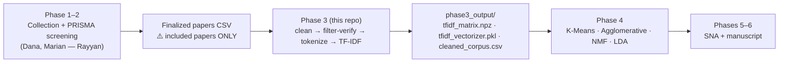

# MuTech Phase 3 — NLP Text Mining & Preprocessing

**Systematic Literature Review on Intelligent Music Processing (MIR)**

Turns the screened papers (CSV) into clean, tokenized, numerical **TF-IDF
vectors** that [Phase 4](https://github.com/UnityGrave/mutech-phase4-clustering)
feeds into the topic models (K-Means, Agglomerative, NMF, LDA).

## 🚀 New here? Start with this

**No local setup needed.** Open `MuTech_Phase3_Text_Mining.ipynb` in
[Google Colab](https://colab.research.google.com) (File ▸ Upload notebook),
run every cell top to bottom, and upload your papers CSV when prompted.
Outputs download automatically at the end.

Running locally instead:

```bash
git clone https://github.com/UnityGrave/mutech-phase3-textmining.git
cd mutech-phase3-textmining
pip install -r requirements.txt
python -m spacy download en_core_web_sm

python text_mining.py --input sample_papers.csv --outdir phase3_output   # try it now
python text_mining.py --input <FINAL_DATASET>.csv --outdir phase3_output # the real run
```

Column names are auto-detected (Scopus / Rayyan / Web of Science exports),
so no code changes are needed between the test and the real run.

## Where this sits in the pipeline



## 📌 Status (last updated July 8, 2026)

| Item | Status |
| --- | --- |
| Phase 3 code | ✅ Done — tested on sample data and verified end-to-end into Phase 4 |
| Waiting on | ⏳ The finalized dataset (Phase 2 / Rayyan screening) |
| Then someone runs | `python text_mining.py --input final.csv --outdir phase3_output` (~5 min) |
| Deadline | Phase 3 due **July 9** |

The code is not the bottleneck. The remaining Phase 3 work is a **handshake
with Phase 2**: getting the export and confirming it's the *included-only* set
(see the warning below). Once that file exists, this phase finishes in minutes.

## What the script actually does (step by step)

1. **Load** the CSV — encoding and delimiter are auto-detected; Scopus, Rayyan,
   and Web of Science header names are all recognized and mapped to standard
   fields (title, abstract, keywords, year, authors, doi, source).
2. **Build one document per paper** from Title + Abstract + Keywords (author
   and index keywords merged). Rows with no usable text at all are dropped.
3. **Clean** — strip HTML tags, lowercase, remove URLs / emails / numbers /
   punctuation, normalize whitespace.
4. **Relevance check** — flag papers containing any `EXCLUDE_KEYWORDS` term
   (medical/off-topic domains). Every dropped paper is written to
   `dropped_papers.csv` **with the reason**. See the warning below for how to
   treat this on the real dataset.
5. **Tokenize with spaCy** — lemmatize, drop stopwords/punctuation/short
   tokens, keep only content words (nouns, proper nouns, adjectives, verbs).
6. **Vectorize** — TF-IDF with unigrams + bigrams (so "source separation"
   survives as one feature), capped at 2,000 terms.

## ⚠️ Read this before the real run

### The export must contain ONLY included papers

This script does **not** read Rayyan's inclusion/exclusion decisions (they
live in a `notes` column this pipeline ignores). If the export contains every
*screened* paper instead of every *included* paper, Phase 3 will happily
vectorize papers the team explicitly excluded, and nothing will error.
**Whoever exports from Rayyan: filter to "Included" first**, and confirm the
row count matches the agreed final corpus size.

### On screened data, `dropped_papers.csv` should be EMPTY

The keyword filter was built for raw, unscreened dumps (the "MRI" papers).
The finalized dataset has already been screened by humans in Rayyan — so the
filter's job flips from *cleaning* to **verification**. If it drops anything
from the final dataset, that is not routine cleanup, it's a disagreement
between this code and Phase 2's screening. Do **not** silently accept it:

- Either Phase 2 let an off-topic paper through → tell Marian, fix it in
  Rayyan, and update the PRISMA counts;
- Or the keyword list is wrong (e.g., a legit music-therapy MIR paper that
  mentions "patients") → remove the offending term from `EXCLUDE_KEYWORDS`
  and re-run.

**Every paper dropped here must be reconciled with the PRISMA flow diagram
in the manuscript.** If Phase 3 drops papers that the PRISMA numbers don't
account for, the SLR's counts won't add up — the exact class of error that
cost us two weeks of revisions on the mini-SLR.

### Post-run verification checklist

After running on the real dataset, check `run_summary.txt` and confirm:

- [ ] `rows read` = the number of included papers agreed with Marian
- [ ] `[harmonize] Detected fields` includes **title AND abstract** (a soft
      `[WARN]` here means columns weren't recognized — stop and fix)
- [ ] `papers dropped` = **0** (or every drop reconciled per the rule above)
- [ ] TF-IDF matrix rows = papers kept
- [ ] Spot-check 3–5 rows of `cleaned_corpus.csv` — does `tokens` look like
      sensible content words?

## Outputs (in `phase3_output/`)

| File | What it is | Who consumes it |
| --- | --- | --- |
| `cleaned_corpus.csv` | One row per kept paper: raw, cleaned, and tokenized text + metadata. | Phase 4 (LDA rebuilds counts from `tokens`), humans |
| `dropped_papers.csv` | Papers removed by the relevance filter, with reasons. | **You** — verify it's empty (see above) |
| `tfidf_matrix.npz` | Sparse TF-IDF document-term matrix. | Phase 4 (K-Means, Agglomerative, NMF) |
| `tfidf_features.txt` | The vocabulary, one term per line. | Debugging, manuscript appendix |
| `tfidf_vectorizer.pkl` | The fitted vectorizer. | Phase 4, and labeling any late-added papers |
| `run_summary.txt` | Counts + settings for the run. | PRISMA reconciliation |

Phase 4 loads them like this (already implemented in the Phase 4 repo — no
work needed, shown for understanding):

```python
from scipy import sparse
import pickle
X = sparse.load_npz("phase3_output/tfidf_matrix.npz")           # docs x terms
vectorizer = pickle.load(open("phase3_output/tfidf_vectorizer.pkl", "rb"))
```

## 🐛 Known issues & gotchas

| Issue | Impact | Workaround |
| --- | --- | --- |
| `f0` include-keyword never matches | Numbers are stripped *before* the relevance check, so "F0" becomes "f". Harmless now (only affects `relevance_score`), but if `REQUIRE_INCLUDE=True` a paper whose only music term is "F0" would be wrongly dropped. | Leave `REQUIRE_INCLUDE=False` (the default), or fix `clean_text` to keep alphanumerics. |
| Malformed CSV rows silently skipped | `on_bad_lines="skip"` drops unparseable rows without logging how many — a PRISMA-count risk. | Compare `rows read` against the row count of the source file after every run. |
| Unrecognized columns only soft-warn | If the export uses header names not in `COLUMN_ALIASES`, fields come back empty and processing continues on thin documents. | Watch for the `[WARN]` line; add the new header name to `COLUMN_ALIASES`. |
| No deduplication step | Dedup is Phase 2's job (per the masterfile), but nothing here checks. Duplicate rows would distort TF-IDF and every Phase 4 cluster. | Verify dedup happened upstream; `pandas.DataFrame.duplicated(subset=["doi"])` is a quick check. |
| Missing abstracts aren't flagged | A paper with only a title still passes, quietly weakening clustering quality. | Spot-check `cleaned_corpus.csv`; count rows with short `tokens`. |
| `min_df=2` on tiny test files | Terms appearing in <2 papers are ignored — on a 5-row test CSV nearly everything vanishes (you'll see a tiny matrix). Correct behavior on the real ~100-paper corpus. | Ignore on toy data, or lower `min_df` for experiments only. |
| Aggressive `EXCLUDE_KEYWORDS` | Terms like "patient", "clinical", "drug" would drop a legitimate health-adjacent MIR paper. | Review every line of `dropped_papers.csv` — never accept drops unseen. |

## Tuning it (only if needed)

Open the **Configuration** section (notebook) or the top of `text_mining.py`:
`EXCLUDE_KEYWORDS` / `INCLUDE_KEYWORDS` (relevance lists), `REQUIRE_INCLUDE`
(keep `False` on screened data), `TFIDF_PARAMS` (`max_features`, `min_df`,
`max_df`, `ngram_range`), `KEEP_POS` / `EXTRA_STOPWORDS` (tokenization).
Everything is seeded/deterministic — same input, same output.

## Masterfile compliance

Phase 3 checklist per the MuTech Masterfile: lowercase normalization ✅ ·
HTML stripping ✅ · spaCy tokenization ✅ · metadata isolation ✅ ·
numerical vectors (TF-IDF) ✅. The relevance filter is an *addition* beyond
the masterfile — treat it as the verification step described above so it
strengthens the methodology instead of complicating the PRISMA accounting.
